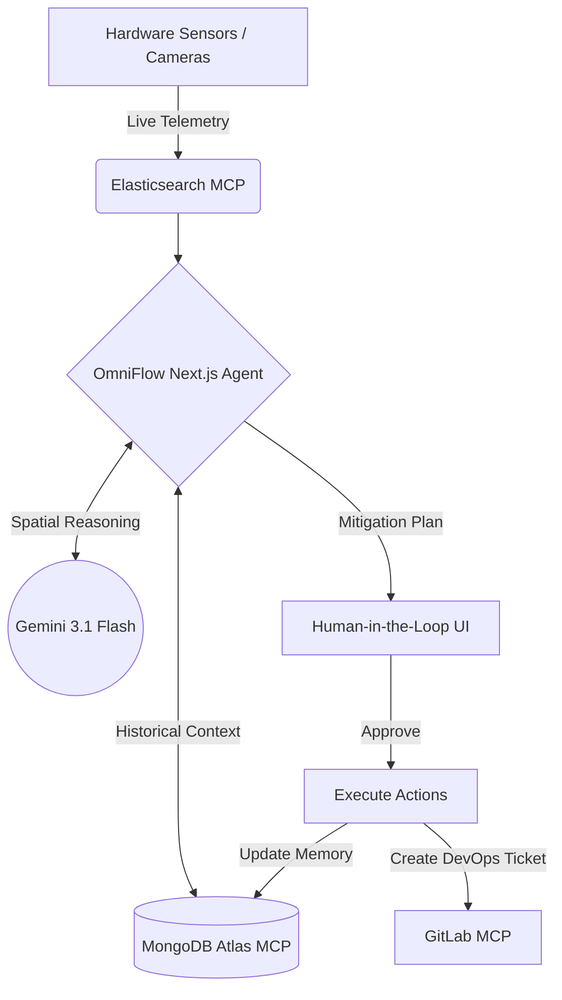

<div align="center">
  
  <h1>🚀 OmniFlow AI</h1>
  <p><b>Autonomous Crowd Infrastructure & Spatial Reasoning Agent</b></p>

  <p>
    
    
    
    
    
  </p>
</div>

---

> **OmniFlow AI** is an advanced, self-healing, continuous-learning infrastructure management system built for the **Google Cloud Rapid Agent Hackathon**. It leverages real-time telemetry, spatial graph algorithms, and the Gemini API (via MCP) to dynamically route crowds, mitigate disasters, and auto-heal its own infrastructure.

---

## 🏗️ System Architecture

OmniFlow isn't just a chatbot—it's a multi-agent orchestration engine.



---

## 🏆 Hackathon Project Details

### 💡 Inspiration: The Crisis of Reaction Time
Modern mass-gathering events—from stadiums hosting the World Cup to massive music festivals—are logistical nightmares. Infrastructure is managed by human operators staring at fragmented, siloed dashboards. When a massive crowd bottleneck occurs, or a transit hub fails, seconds matter. By the time human operators identify the problem across multiple screens, formulate a mitigation plan, and contact DevOps to update digital signage or reroute traffic, it's often too late. 

We asked ourselves a critical question: *What if an Agentic AI could instantly ingest an entire venue's infrastructure telemetry, cross-reference historical disaster solutions from past events, and generate executable spatial mitigation plans in real-time?* Thus, OmniFlow AI was born.

### ⚙️ What it does: The Autonomous Loop
OmniFlow AI operates in a flawless, multi-step agentic loop:
1. **📡 Detects & Ingests:** Monitors simulated, high-speed telemetry firehose data from hardware endpoints.
2. **🧠 Spatial Reasoning:** Dispatches raw anomaly data to **Gemini 3.1 Flash** to execute live spatial reasoning based on the physical layout of the venue.
3. **🗄️ Continuous Learning via Memory:** Utilizes the **Model Context Protocol (MCP)** to query a **MongoDB Atlas** database. It searches its own "memory bank" to find out how this specific venue solved similar problems in the past.
4. **🚦 Execution & HITL:** Drafts a highly precise mitigation plan. Because it controls critical physical infrastructure, it halts execution to request **Human-In-The-Loop (HITL)** authorization via an interactive UI.
5. **🦊 DevOps & Self-Updating:** Once authorized, the agent uses MCP to automatically generate a live **GitLab** DevOps ticket. Finally, it physically writes the new solution back into MongoDB Atlas, permanently "learning" from the incident.

### 🚧 Challenges we ran into: Pushing Cloud Limits
Integrating three distinct enterprise MCP servers concurrently inside a single Next.js API route proved extremely taxing on server memory. During testing, when the AI prompted multiple tools simultaneously, our Google Cloud Run instance suffered a massive Out of Memory (OOM) fatal crash. We had to live-debug the Google Cloud Run logs and dynamically provision a heavier, custom **4GB RAM instance** to handle the massive multi-agent processing load required by the AI pipeline. 

### 🛡️ The Auto-Healer
We built a custom deterministic "Auto-Healer" algorithm. If the primary Gemini API connection times out or fails due to network degradation, our system automatically falls back to a deterministic spatial execution plan—ensuring the infrastructure is never left unmanaged.

---

## 💻 Local Development Setup

### 1. Prerequisites
- Node.js (v18+)
- Git
- Google Cloud / Gemini API Keys

### 2. Installation
```bash
git clone https://github.com/HamzaKhanBUIC/omniflow-ai.git
cd omniflow-ai
npm install
```

### 3. Environment Variables
Create a `.env.local` file in the root directory and copy the contents from `.env.example`. You will need to fill in your API keys:
```env
GEMINI_API_KEY="your_gemini_key"
GITLAB_PERSONAL_ACCESS_TOKEN="your_gitlab_token"
MONGODB_CONNECTION_STRING="your_mongodb_uri"
ELASTICSEARCH_URL="your_elastic_url"
ELASTICSEARCH_API_KEY="your_elastic_key"
```

### 4. Run the Application
```bash
npm run dev
```
Navigate to `http://localhost:3000` to view the dashboard!

---

## ☁️ Google Cloud Run Deployment

OmniFlow is designed to be deployed as a serverless container on **Google Cloud Run** using native Cloud Buildpacks.

### Step 1: Authenticate
```bash
gcloud auth login
```

### Step 2: Deploy to Cloud Run
Deploy the app directly from your terminal. Google Cloud will automatically detect the Next.js framework, containerize it, and deploy it to the edge:
```bash
gcloud run deploy omniflow-ai --source . --region us-central1 --allow-unauthenticated
```

### Step 3: Scale Memory for Heavy MCP Execution
Because OmniFlow simultaneously executes complex Node-based MCP connections to multiple enterprise platforms, it requires a high-memory environment to prevent OOM (Out of Memory) crashes:
```bash
gcloud run services update omniflow-ai --memory=4Gi --region us-central1
```

### Step 4: Inject API Keys
Once deployed, inject your secure environment variables into the live Cloud Run instance:
```bash
gcloud run services update omniflow-ai \
  --region us-central1 \
  --set-env-vars="GEMINI_API_KEY=...,GITLAB_PERSONAL_ACCESS_TOKEN=...,MONGODB_CONNECTION_STRING=...,ELASTICSEARCH_URL=...,ELASTICSEARCH_API_KEY=..."
```

---

## 🛠️ Infrastructure Maintenance

### Gemini Auto Storage Cleaner
If your Gemini API File storage becomes bloated, OmniFlow includes a self-healing script to purge orphaned files across all configured keys.

To run it manually locally:
```bash
npm run clean:gemini
```
*(Note: OmniFlow will automatically trigger this in the background if it detects an API quota anomaly during a live simulation).*

---
<div align="center">
  <b>Built with ❤️ for the Google Cloud Hackathon</b>
</div>
