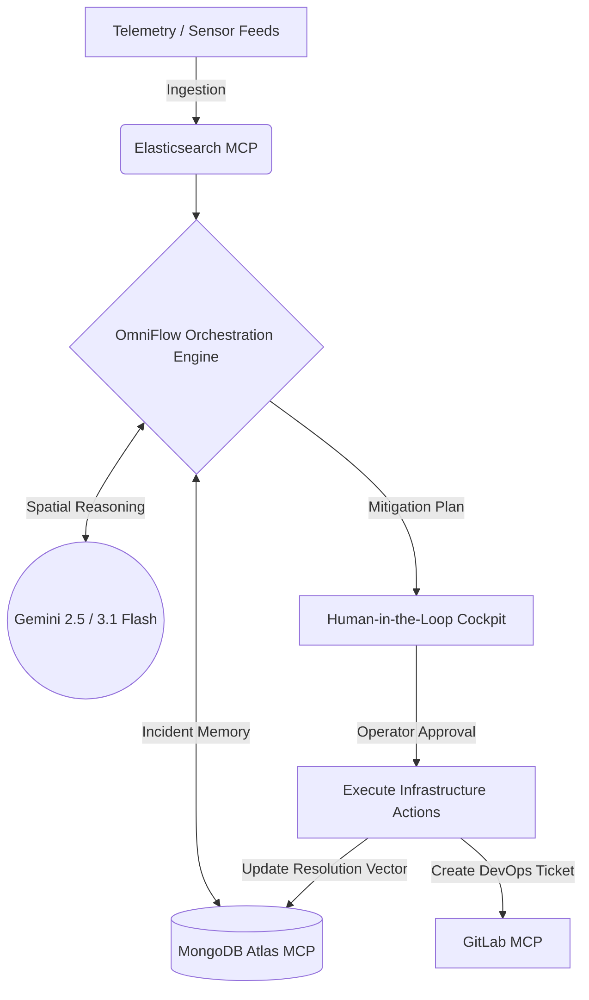

# OmniFlow AI: Autonomous Crowd Infrastructure & Spatial Reasoning Agent

> Event-driven spatial reasoning and infrastructure triage agent utilizing Model Context Protocol (MCP) tool bindings, Google Cloud Run, and Gemini reasoning.

[](https://cloud.google.com/run)
[](https://nextjs.org/)
[](https://modelcontextprotocol.io/)
[](LICENSE)

---

## Overview

Large-scale venue and transit operations require rapid spatial coordination during crowd congestion bottlenecks or emergency sector closures.

**OmniFlow AI** is an infrastructure triage and spatial routing system that:
1. Ingests simulated telemetry feeds via Elasticsearch MCP connectors.
2. Performs spatial graph routing and anomaly analysis using Gemini models.
3. Retrieves historical incident resolutions from MongoDB Atlas.
4. Generates human-reviewed mitigation workflows and creates automated incident tickets via GitLab MCP endpoints.

---

## System Architecture



---

## Core Capabilities

- **MCP Tool Protocol Integration**: Standardized tool calling interfaces connecting Elasticsearch (telemetry queries), MongoDB Atlas (memory persistence), and GitLab (automated issue creation).
- **Spatial Incident Triage**: Analyzes physical layout graphs and sensor choke points to calculate alternative pedestrian routes.
- **Human-in-the-Loop Authorization**: Critical physical changes (digital signage updates, turnstile gates) require operator sign-off before downstream dispatch.
- **Deterministic Failover Engine**: If external LLM APIs experience rate limits or timeouts, the engine falls back to pre-compiled deterministic routing heuristics.

---

## Repository Structure

```
.
├── src/
│   ├── app/                  # Next.js App Router and API endpoints
│   ├── components/           # Spatial map views and incident cockpit
│   ├── lib/
│   │   ├── mcp/              # MCP client integrations (GitLab, Mongo, Elastic)
│   │   ├── gemini.ts         # Gemini spatial reasoning interface
│   │   └── auto-healer.ts    # Deterministic heuristic fallback engine
├── public/                   # Static assets and venue map definitions
├── package.json
└── README.md
```

---

## Getting Started

### Prerequisites
- Node.js 18 or higher
- API credentials for Gemini, MongoDB Atlas, and GitLab (optional for ticketing)

### Local Setup

1. **Clone the repository**:
   ```bash
   git clone https://github.com/HamzaKhanBUIC/omniflow-ai.git
   cd omniflow-ai
   npm install
   ```

2. **Configure environment variables**:
   Create `.env.local`:
   ```env
   GEMINI_API_KEY=your_gemini_api_key
   GITLAB_PERSONAL_ACCESS_TOKEN=your_gitlab_token
   MONGODB_CONNECTION_STRING=your_mongodb_uri
   ELASTICSEARCH_URL=your_elastic_url
   ELASTICSEARCH_API_KEY=your_elastic_key
   ```

3. **Start development server**:
   ```bash
   npm run dev
   ```
   Open `http://localhost:3000` in your browser.

---

## Google Cloud Run Deployment

```bash
# Build container image via Cloud Build
gcloud builds submit --tag gcr.io/YOUR_PROJECT_ID/omniflow-ai

# Deploy to Cloud Run with 2 vCPU / 4 GB configuration
gcloud run deploy omniflow-ai \
  --image gcr.io/YOUR_PROJECT_ID/omniflow-ai \
  --platform managed \
  --region us-central1 \
  --memory 4Gi \
  --cpu 2 \
  --allow-unauthenticated \
  --set-env-vars GEMINI_API_KEY=your_key
```

---

## License

This project is licensed under the MIT License. See [LICENSE](LICENSE) for details.
